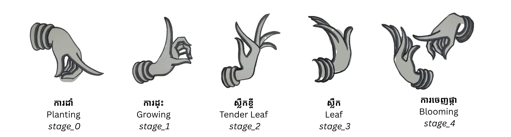

# Kbach Flower: a flower that grows with your hands

Hold your hand up to a webcam and a glowing flower, made of hundreds of small colored dots, grows on it.
Change the shape of your hand and the flower changes with it: from a tiny bud, to young leaves, to a lily in full bloom.

## Inspiration

In Khmer classical dance, the dancer's hand gestures tell the story of a plant's life: it sprouts, grows leaves, flowers and bears fruit. There are many of these gestures.

This project uses **5 of them**. Each hand pose is linked to one stage of the flower's growth:



| Stage | Khmer | English |
|---|---|---|
| 0 | ការដាំ | **Planting** |
| 1 | ការដុះ | **Growing** |
| 2 | ស្លឹកខ្ចី | **Tender Leaf** |
| 3 | ស្លឹក | **Leaf** |
| 4 | ការចេញផ្កា | **Blooming** |

When your hand moves from one pose to the next, the flower doesn't jump. It grows into the next stage dot by dot, like the smooth movement between gestures in the dance.

---

## How it works

```
your hand → webcam → read hand shape → match to a dance pose → draw the flower at that stage
```

1. **Find the hand.** Google's [MediaPipe](https://developers.google.com/mediapipe/solutions/vision/hand_landmarker) finds 21 points on each hand (the wrist, the knuckles and the fingertips).
2. **Turn the shape into numbers.** From those points we measure how bent each finger is, how spread the fingers are, how far the thumb sticks out, and which way the hand points.
3. **Match it to a pose.** The project comes with example recordings of each dance pose (`poses.json`). The program checks which one your hand looks most like right now.
4. **Blend the stages.** If your hand is between two poses, the flower shows a mix of both stages.
5. **Draw the glow.** Each stage is a "dot recipe" made from a real photo. The dots get a soft glow and are drawn on top of the camera picture, with the stem sitting on your wrist.

---

## Project files

| File | What it does |
|---|---|
| `photo_flower_ar.py` | **The main app.** Opens the webcam and shows the flower on your hand. |
| `hand_bridge.py` | Finds hands and turns their shape into numbers. |
| `growth.py` | Compares your hand to the saved poses and decides how much of each stage to show. |
| `photo_flower.py` | Draws the glowing dot flower and blends between stages. |
| `extract_flower.py` | Turns flower photos into dot recipes. You only need it when you change the photos. |
| `poses.json` | Example hand poses for each of the 5 stages. Ready to use. |
| `flower-project-assets/` | The 5 lily photos (`stage_0.png` to `stage_4.png`) the recipes were made from. |
| `stage_recipes/` | One dot recipe per stage (`stage_0.json` to `stage_4.json`): where each dot goes and what color it is. |
| `hand_landmarker.task` | Google's hand-tracking model. |
| `requirements.txt` | The Python packages to install. |
| `docs/` | Images used in this README. |

---

## Setup

You need **Python 3.11** and a webcam.

```bash
git clone https://github.com/lymiychrean-sys/khmer-kbach-flower.git
cd khmer-kbach-flower
python3.11 -m venv venv
./venv/bin/pip install -r requirements.txt
```

If `hand_landmarker.task` is missing, download it:

```bash
curl -fL -o hand_landmarker.task "https://storage.googleapis.com/mediapipe-models/hand_landmarker/hand_landmarker/float16/latest/hand_landmarker.task"
```

On a Mac, allow Terminal (or VS Code) to use the camera the first time you run it.

---

## Run it

```bash
./venv/bin/python photo_flower_ar.py
```

Make the dance poses in front of the camera and watch the flower grow. It works right away, with no training or recording needed. Press **q** to quit.

---

## Use your own photos

1. Get **5 photos**, one for each dance pose, with the **background removed** (a PNG with a see-through background). It has to be exactly 5, because the saved poses in `poses.json` are made for 5 stages.
2. Name them `stage_0.png`, `stage_1.png`, … in order from first stage to last.
3. Put them in the `flower-project-assets/` folder inside this project, replacing the lily photos:
   ```
   flower-project-code/
   ├── flower-project-assets/   ← your photos go here
   ├── stage_recipes/
   └── ...
   ```
4. Build the recipes:
   ```bash
   ./venv/bin/python extract_flower.py
   ```
   Or list photos from anywhere, in order: `./venv/bin/python extract_flower.py a.png b.png c.png ...`

The app doesn't read the photos when it runs. The recipes in `stage_recipes/` already hold everything it draws.

---

## Settings you can change

| Setting | File | What it changes |
|---|---|---|
| `WEIGHT_SMOOTHING` | `photo_flower_ar.py` | How fast the flower changes stage. Lower = smoother and slower. |
| `POS_SMOOTHING` | `photo_flower_ar.py` | How closely the flower follows your hand. Lower = smoother but it lags more. |
| `SHARPNESS` | `growth.py` | Higher = snaps to one stage. Lower = more blending between stages. |
| `STAGE_SCALE` | `photo_flower.py` | How big each stage is drawn. |
| `DISSOLVE_BAND` | `photo_flower.py` | How soft the dot-by-dot grow-in looks. |
| `scale` in `draw_photo_flower` | `photo_flower.py` | The overall size of the flower on screen. |
| `CELL` | `extract_flower.py` | The gap between dots. Smaller = more detail (but slower). |

---

## Troubleshooting

- **"Could not open camera"**: another app is using the webcam, or camera access is off. Check System Settings → Privacy & Security → Camera.
- **"Missing model file"**: download `hand_landmarker.task` (see Setup).
- **"has no alpha channel"**: the photo still has a background. Remove it first.
- **"No stage_*.png images found"**: `extract_flower.py` couldn't find your photos. Check they're in the `flower-project-assets/` folder inside this project and named `stage_0.png`, `stage_1.png`, …

---

## Credits

- **Lily photos:** the 5 flower stages are frames from a lily time-lapse by [eLapse](https://www.youtube.com/@eLapseTime) on YouTube. The dot recipes in `stage_recipes/` are made from these frames.
- **Hand-gesture illustration** (`docs/kbach-stages.png`): by Prum MengChheng ([@ChhengCM on Pinterest](https://www.pinterest.com/ChhengCM/)).
- **Gestures:** from Khmer classical dance.

---

## Built with

- [MediaPipe](https://developers.google.com/mediapipe): hand tracking
- [OpenCV](https://opencv.org/) (`cv2`): webcam, images and drawing
- [NumPy](https://numpy.org/): number crunching
